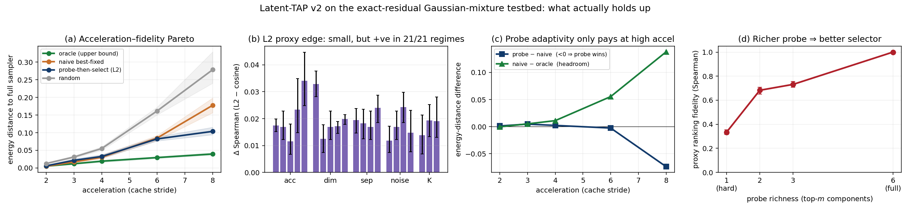

# Latent Token-Adaptive Predictor (Latent-TAP)

**What actually helps a training-free diffusion predictor? A falsification study of
token-adaptive prediction on an exact-residual testbed.**

Bhavith Chandra Challagundla — [Bhavith-Chandra.github.io](https://Bhavith-Chandra.github.io)

📄 **Paper:** [`paper/Latent-TAP-v2_paper.pdf`](paper/Latent-TAP-v2_paper.pdf)
&nbsp;•&nbsp; Companion study: [`paper/Probe-Emergence_paper.pdf`](paper/Probe-Emergence_paper.pdf)

---

## TL;DR

Training-free diffusion accelerators (TAP, TeaCache, ToCa, DiCache, TaylorSeer, FORA)
reconstruct skipped network outputs from cached features, choosing *which* cheap predictor
to trust — per token — by reading a first-layer **probe** and ranking predictors with a
cosine proxy. A single-seed pilot of ours suggested three improvements. This repository is
the adversarial follow-up that tries to **break** them. Most do not survive.

On an **exact-residual Gaussian-mixture testbed** — where the true denoiser output is
closed-form (Tweedie), so every predictor's true error is known without a trained network —
we run a 12-seed core study, a 21-regime sweep, and a pre-registered 30-test suite, all with
bootstrap 95% CIs.

| Lever (from the pilot) | Verdict | Evidence |
|---|---|---|
| **L2 proxy > cosine** | holds, but **small** (not "tripled") | delta-Spearman **+0.016** (CI +0.014,+0.019); positive in **21/21** regimes; grows with difficulty |
| **Online predictors > fixed Taylor** | **refuted** | Taylor better in **19/21** regimes, online wins **0/21** |
| **Probe-then-select > naive best-fixed** | only at **aggressive acceleration** | Beats naive in **1/21** regimes (stride 8); elsewhere the *speedup*, not the adaptivity, drives gains |

**The reframing.** TAP's per-token selection is separable, equal-cost, and unconstrained,
so greedy selection is *already the global optimum* — there is no selection-optimization gap
to close. The real object is **proxy fidelity**: an oracle selector leaves headroom the probe
cannot capture, and fidelity rises monotonically with **probe richness** (0.33 → 1.0). The
lever that scales is a better/richer probe, not a cleverer selection rule.

## Honesty notes (read these)

- **TAP (arXiv:2603.03792) has no public code.** All TAP behaviour here rests on a faithful
  reimplementation of its probe-then-select *mechanism*, not a reference codebase.
- The testbed is a **shallow analytic denoiser**. Its hard-assignment probe is a *weaker*
  ranker than a real DiT's learned first layer (which a companion study measures at
  Spearman ~= 0.77). The testbed therefore **lower-bounds** the probe's value; results here
  are conservative. The probe-richness curve (Fig. 3d) quantifies exactly this gap.
- Absolute energy-distance magnitudes are testbed-specific; every claim uses **paired,
  within-regime** comparisons only.

## Results at a glance



**(a)** acceleration–fidelity Pareto (probe tracks naive until high stride) •
**(b)** L2 edge over cosine: small but positive in 21/21 regimes •
**(c)** probe adaptivity only pays at aggressive acceleration •
**(d)** proxy fidelity rises with probe richness (0.33 → 1.0).

## Repository layout

```
src/          pure-NumPy testbed, experiments, and the 30-test suite (+ archived result JSON)
paper/        compiled PDF, LaTeX source, figure, and companion study
figures/      results figure
```

## Reproduce

Everything is pure NumPy (no GPU, no PyTorch). SciPy is optional.

```bash
cd src
pip install numpy scipy matplotlib

python run_core.py      # 12-seed core study  -> core_raw.json   (resumable; re-run until ALL_DONE)
python agg_core.py      # aggregate with bootstrap CIs -> core_agg.json
python sweep.py         # 21-regime sweep     -> sweep_raw.json  (resumable; re-run until ALL_DONE)
python sweep_agg.py     # aggregate + crossover verdicts -> sweep_agg.json
python probe_depth.py   # probe-richness curve -> probe_depth.json
python pressure_v2.py   # 30-test adversarial suite -> pressure_v2.json  (26 PASS / 4 NOTE / 0 FAIL)
python plot_v2.py       # -> fig_v2.png
```

`run_core.py` and `sweep.py` checkpoint after every seed/cell, so they can be interrupted
and resumed; invoke repeatedly until they print `ALL_DONE`. The archived `*.json` in `src/`
are the exact results used in the paper.

## Rebuild the paper

```bash
cd paper
pdflatex paper_v2.tex && pdflatex paper_v2.tex   # needs TikZ + pgfplots (TeX Live)
```

## What's in the testbed (`src/latap_v2.py`)

- `GMM` — K-component isotropic Gaussian mixture with the **exact** posterior-mean denoiser
  (`denoise_full`), a cheap hard-assignment **probe** (`denoise_probe`), and a tunable
  top-m soft probe (`denoise_probe_topm`) for the richness sweep.
- `FAM` — 8 predictors: fixed finite-difference Taylor (orders 0–2, horizons 1–2) + online
  least-squares (deg 2–3, windows 5–6).
- `run(...)` — accelerated DDIM sampler with selectors `{vanilla, naive, probe, oracle,
  random}`, proxy metrics `{cos, l2, l1}`, family restriction, and a budget/abstaining mode.
- `measure_proxy(...)` — walks the exact (vanilla) trajectory and records, per token,
  Spearman(proxy-error, true-error) and top-1 pick accuracy for each metric.
- `energy_distance`, `spearman_axis0`, `boot_ci` — vectorized metrics and bootstrap CIs.

## Citation

```bibtex
@techreport{challagundla2025latap,
  title  = {What Actually Helps a Training-Free Diffusion Predictor?
            A Falsification Study of Token-Adaptive Prediction on an Exact-Residual Testbed},
  author = {Challagundla, Bhavith Chandra},
  year   = {2025},
  note   = {https://github.com/Bhavith-Chandra/Latent-Token-Adaptive-Predictor}
}
```

## License

MIT — see [LICENSE](LICENSE).
